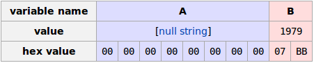
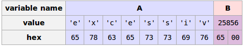
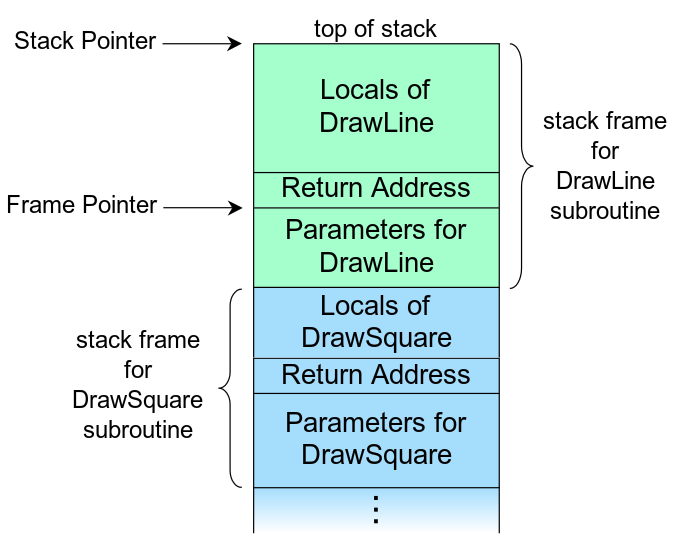

% CSE30 Discussion 3
% Ibrahim Awwal
% July 6, 2015

## Any questions?

- Raspberry Pi Setup
- Number representations
- C language
- Tools
- PA1

# C

## The C Programming Language (K&R)

## Pointers

- point to a location in memory
- declaration: `int *intPtr;`
- getting an address: `intPtr = &x;`
- "dereferencing" a pointer gets the value pointed to: `*intPtr`

## Pointer arithmetic

- In general, we cannot perform arbitrary assignments to a pointer and expect to read valid memory (often results in segfaults)
- Exception: we can add or subtract from a pointer to navigate an array
- Incrementing a pointer increments by `sizeof(type)` being pointed to, not by 1 memory address

## Strings

- `int strlen(char *string)`
- `int strcpy(char *dst, char *src)`
- `int strcmp(char *str1, char *str2)`

## strlen

. . .

~~~~{.c}
int strlen(char *string){
    int n;
    for (n = 0; *s != '\0', s++){
        n++;
    }
    return n;
}
~~~~

## strcpy

. . .

~~~~{.c}
char *strcpy(char *dst, char *src){
    int i = 0;
    while ((dst[i] = src[i]) != '\0'){
        i++;
    }
    return dst;
}
~~~~

. . .

- src and dst cannot be overlapping, why?

## strcpy with pointer arithmetic

~~~~{.c}
char *strcpy(char *dst, char *src){
    while (*dst++ = *src++);
    return dst;
}
~~~~

- How does this work?

## strcmp

~~~~ {.c}
int strcmp(char *s, char *t){
    for ( ; *s == *t; s++, t++){
        if (*s == '\0'){
            return 0;
        }
    }
    return *s - *t;
}
~~~~

## The Problem with strlen, strcpy, strcmp

> - What's wrong with these functions?
> - C does not store length alongside arrays
> - Naive versions can potentially access memory improperly if given non-terminated strings or insufficient space

## Buffer overflow

~~~~ {.c}
char           A[8] = "";
unsigned short B    = 1979;
strcpy(A, "excessive");
~~~~

. . .

. . .

\note{Show example here}

## Solution: Passing the lengths of string to functions

- The C standard library includes string functions which take the maximum length of the string as arguments (eg. `strnlen`, `strncpy`, etc.)
- These versions are less prone to buffer overruns
- more info: [http://www.cplusplus.com/reference/cstring/](http://www.cplusplus.com/reference/cstring/)
- standard library functions also have man pages (eg. `man strcpy`, `man malloc`, etc.)

## Memory Allocation

\note{What's the difference between}

- stack
- heap
- static

## Example

~~~~~~~~ {.c .numberLines}
\include{"src/allocation.c"}
~~~~~~~~

## The Stack

Assume `DrawSquare()` calls `DrawLine()`

## Lifetime of a variable

> - stack: lives until the end of the function call in which it is defined
> - heap: lives until it is freed
> - static: until program ends

## malloc

- to allocate memory on the heap, use `malloc`
- function signature:
~~~~ {.c}
void* malloc (size_t size);
~~~~

- we *must* free memory allocated by malloc
- failure to do so is a memory leak
- freeing a pointer while others still hold references to it is also a potential error

## malloc details (K&R 8.7)
- keeps a list of free blocks of memory
- each block contains a size, pointer to next block, and the free space
- when a request is made, the list is scanned until a block big enough is found
- when a block is found, it is returned and removed from the free list
- if no sufficiently large block exists, ask the OS for more

## free details (K&R 8.7)

- scans the free list looking for the freed block's address
- adds an entry to the list if between two blocks
- merges free blocks if adjacent

# More Tools

## Valgrind

- Valgrind is a set of debugging and profiling tools
- The most common use for Valgrind is checking for memory errors

## Example C program

~~~~~~~~ {.c .numberLines}
\include{"src/memleak.c"}
~~~~~~~~

## Errors in previous program
> - problem 1: heap block overrun
> - problem 2: memory leak -- x not freed

## Let's run valgrind on this program
