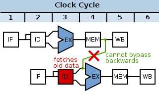

% CSE30 Discussion 9 - Final Review
% Ibrahim Awwal
% July 27, 2015

# Pointers and Memory

## Pointer Arithmetic

~~~~ {.c}
int arr[4] = {256, -1, 3, 0xAABBCCDD}
int *ptr = arr;
*(ptr+1);
*(((char *) ptr) + 1);
~~~~

- `ptr+1` increments by 1*sizeof(datatype)
- Casting a pointer changes the increment
- Subtracting pointers within same array makes sense, adding does not - why?

## Heap/Stack

## Memory Alignment

- Processors read multiple bytes from memory at once
- Variable address must be aligned on a multiple of the size
- Struct fields should be ordered to minimize padding
- Array of Structs vs Struct of Arrays

## Structs in Assembly

- Compute offsets into struct to read individual fields
- Be aware of alignment/padding when calculating offsets

~~~~ { .c}
struct foo{
    char c;
    short s;
    int x;
}
~~~~
~~~~
@@ r0 is address of struct
ldrb r1, [r0, #0]   @@ c
ldrh r2, [r0, #2]   @@ s
ldr r3, [r0, #4]    @@ x
~~~~

## Multi dimensional vs multi level arrays

- Multi dimensional: `int X[3][4];`
- Multi level:
    - `int *X[3]; X[0] = (int *) malloc(4*sizeof(int));`
- Instructions needed to access an element?
- When would we use each type?

## Endianness

- Little Endian: LSB stored first
- Big Endian: MSB stored first
- x86, ARM are both Little Endian (though ARM can be configured Big Endian)
- Network byte order is Big Endian

Example: int x = 0x12345678; &x=0x8000

| Address | 0x8000 | 0x8001 | 0x8002 | 0x8003 |
|---------+--------+--------+--------+--------|
| Little  |   0x78 |   0x56 |   0x34 |   0x12 |
| Big     |   0x12 |   0x34 |   0x56 |   0x78 |

# Assembly Programming

## Bit manipulations

- Clearing bits: BIC, Shifts, AND
- Setting bits: OR
- Masking

## Conditional Execution

~~~
CMP r0, #0
BEQ null
LDR r0, [r0]
null: MOV r0, #-1
~~~

## Function Call Conventions

1. Save temporary registers onto the stack (`push`)
2. Put arguments in r0-r3 (additional arguments on stack)
3. Branch and link to target address (`bl <funcname>`)
4. Callee puts return value in r0-r1
5. Callee branches back to link register (`bx lr`)

- Caller vs Callee save registers?
- [ARM Architecture Procedure Call Standard (AAPCS)](http://infocenter.arm.com/help/topic/com.arm.doc.ihi0042e/IHI0042E_aapcs.pdf)

## Nested and Recursive Function Calls

- Set up a function call as usual
- `bl <funcname>`
- After function returns, which instruction is executed next?

~~~ {.c}
int some_func(int arg){
...
return some_func(arg-1);
}
~~~

- What does this recursive call correspond to?
- What about `return some_func(arg-1) + some_func(arg-2);`

## Stack

- Basic operations: `push`, `pop`
- `sp` points to top of stack (last entry pushed)
- Stack grows downward
- Each function call has its own "stack frame"

## Miscellaneous Gotchas

- Not saving required registers onto the stack
- Using volatile registers between function calls
- Incorrect recursive calls (bl without returning)
- Conditional branches not accounting for fall through
- Not indexing by data type size
- Forgetting to increment loop counter

# Pipelining

## Pipeline intro

- Idea: Split execution of an instruction into multiple stages
- Multiple instructions can then execute in parallel, also can shorten time for each stage
- Increases Instructions Per Cycle (IPC) or Instruction Level Parallelism (ILP)
- Less logic per stage => shorter clock period needed
- What is the drawback?
- What is the limitation of this technique?

## 5 stage pipeline

1. Instruction fetch
2. Instruction Decode/Register read
3. Execution
4. Data Memory
5. Register Write

## Hazards

- Not every set of instructions can be parallelized
- If one instruction uses result of previous instruction as operand, we need to wait for this result (data hazard)
- Register write happens in first half of cycle (stage 5)
- Register read happens in second half of cycle (stage 2)
- If we have a conditional branch, we can't continue pipelining instructions until we know whether the branch is taken (control hazard)

## Examples of data hazards

~~~
ADD r2, r0, r1
MUL r2, r2, r3
~~~

~~~~
LDR  r4, [r0]
AND r5, r4, r1
~~~~

<!--  -->

<!--  -->

## Handling Data Hazards

- Insert NOPs during compilation
- Stall pipeline (in hardware) and wait for result
- Reorder instructions (before assembling) to eliminate stalls
- Forward result from previous stages

## Example: Arithmetic

\begin{figure}
\includegraphics[width=0.9\textwidth]{NOPs}
\end{figure}

## Example: Forwarding

\begin{figure}
\includegraphics[width=0.8\textwidth]{forwarding}
\end{figure}

## Examples: Data memory

~~~~
LDR  r4, [r0]
AND r5, r4, r1
~~~~

\begin{figure}
\includegraphics[width=0.4\textwidth]{ldr_pipeline_error}
\end{figure}

\begin{figure}
\includegraphics[width=0.4\textwidth]{ldr_pipeline_bubble}
\end{figure}

## Bonus Architecture Techniques

- Caches: Main memory can take 100s of cycles to access, so put commonly accessed data closer to CPU
- Branch Prediction: Predict whether a branch will be taken, where it will go
- Out of Order Execution: Reorder instructions to eliminate pipeline stalls
- Superscalar: Use multiple functional units to issue and process multiple instructions at once

# Practice Final Questions
